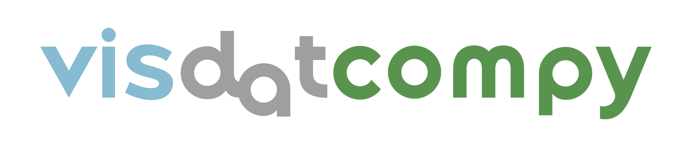

# Библиотека для сравнения визуальных наборов данных.

# Описание проекта
___
Проект "visdatcompy" представляет собой библиотеку, направленную на сравнение визуальных наборов данных с целью оптимизации процесса повторного обучения нейросетей. Главная проблема, которую решает проект, заключается в значительном времени, требующемся для обучения нейронных сетей. Мы создаем инструментарий для сбора характеристик и метаданных изображений, а также для сравнения датасетов по метрикам, что позволяет избежать повторного обучения нейросети при высокой степени схожести.

Цель проекта - разработать сервис (библиотеку), способную эффективно сравнивать визуальные наборы данных. Задачи включают разработку архитектуры сервиса, выбор методов сравнения визуальных наборов данных, создание инструментов для работы с директориями, извлечения характеристик и сбора метаданных изображений.

Прототип сервиса включает функционал рекурсивного обхода папок, поиска изображений и сохранения данных в формате списка кортежей. Далее осуществляется сбор метаданных изображений, создание pandas dataframe для работы с данными или их экспорта в формате .csv. Технологический стек проекта включает Python, IDE VS Code и Jupyter Notebook для разработки, а также библиотеки os, scikit-learn, scikit-image, pandas, pillow, matplotlib, opencv, numpy для обработки изображений и данных.

Проект стремится не только оптимизировать сравнение визуальных наборов данных, но и обеспечить пользовательский интерфейс для удобного взаимодействия с инструментами, сделав его доступным в виде консольного приложения или библиотеки.

## Используемые библиотеки:

-   Pillow - https://pypi.org/project/pillow/
-   Scikit Learn - https://pypi.org/project/scikit-learn/
-   NumPy - https://pypi.org/project/numpy/
-   Pandas - https://pypi.org/project/pandas/
-   Colorama - https://pypi.org/project/colorama/

## Установка

Чтобы установить visdatcompy, выполните следующие шаги:

```bash
pip install visdatcompy
```
## Метрики и функции для сравнения изображений
Метрика - расстояние, определённое для любых двух элементов (точек) некоторого множества X. То есть это функция, которая возвращает расстояние между двумя объектами. Благодаря этому свойству мы можем расположить объекты от "идентичны" до "абсолютно разные".
___

#### 1. Pix2Pix:
 Функция для попиксельного сравнения пары изображений.

Диапазон значений: True/False
- a) Самая большая скорость работы
- b) Распознает только абсолютно одинаковые изображения
- c) Не требует дополнительных библиотек кроме Pillow и Numpy
___
#### 2. MSE:
Среднеквадратичная ошибка между изображениями</p>
**Диапазон значений:** [0; ∞)
- a) Высокая скорость работы
- b) На изображениях со схожими тенями постройки показатели сходятся с показателями на изображениях без этой тени
___
#### 3. NRMSE
Нормализованная среднеквадратическая ошибка

**Диапазон значений:** [0, 1]
  - a) Время работы больше чем MSE
  - b) На изображениях со схожими тенями заметно меньше показатель (большее сходство изображений)
___
#### 4. SSIM
Структурное сходство изображений

 **Диапазон значений:** [-1;1]
  - a) Время работы еще больше чем NRMSE
  - b) У изображений с похожей тенью одинаково больше показатель чем у двух прочих
___
#### 5. PSNR
Отношение максимального значения сигнала к шуму

**Диапазон значений:** (0; ∞)
  - a) Время работы наравне с NRMSE
  - b) Большой диапазон значений, большая разница в сравнении
___
#### 6. MAE
Средняя абсолютная ошибка между изображениями

**Диапазон значений:** [0; ∞)
  - a) Высокая скорость работы, немного дольше P2P
  - b) На изображениях с видимым сходством наоборот значение более высокое. Возможно сравнивает по нестандартным значениям.
___
#### 7. NMI
Нормализованный показатель взаимной информации

**Диапазон значений:** [1;2]
  - a) Время работы незначительно больше NRMSE
  - b) Примерно одинаковые значения при сравнении (при значениях в три знака после запятой), возможно более детализированное сравнение.
___

___
## Статус проекта
Проект в настоящее время находится в стадии активной разработки.
___
<p align="center">
    <a href="https://github.com/xuri/excelize/actions/workflows/go.yml"></a>
    <a href="https://codecov.io/gh/qax-os/excelize"></a>
    <a href="https://goreportcard.com/report/github.com/xuri/excelize/v2"></a>
    <a href="https://pkg.go.dev/github.com/xuri/excelize/v2"></a>
    <a href="https://opensource.org/licenses/BSD-3-Clause"></a>
    <a href="https://www.paypal.com/paypalme/xuri"></a>
</p>

